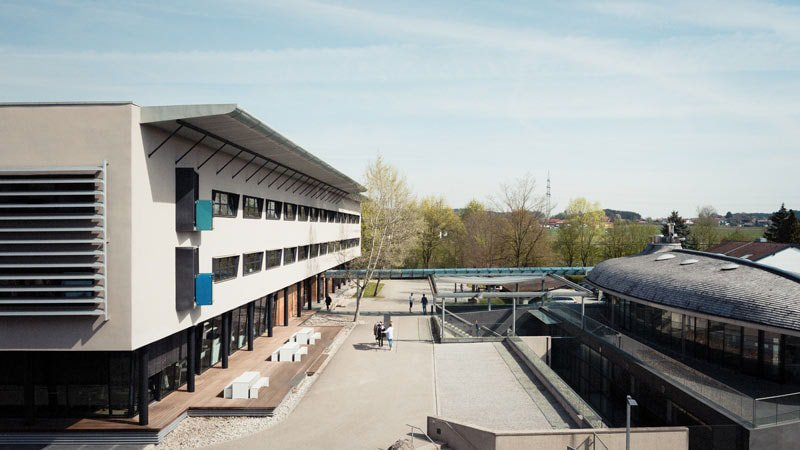

# Marc O'Polo

MARC O’POLO steht für einen lässigen Lifestyle mit gehobenem Anspruch. Charakteristisch für die Marke mit schwedischen Wurzeln ist die Vorliebe für natürliche Materialien. 1967 in Stockholm gegründet, ist MARC O’POLO heute eine der international führenden Premium Modern Casual Marken. Die MARC O’POLO Welt umfasst die Kollektionen MARC O’POLO Modern Casual Women & Men, MARC O’POLO DENIM, MARC O’POLO Shoes und MARC O’POLO Accessories sowie die Lizenzen Beachwear, Bodywear, Eyewear, Home, Junior und Legwear.

